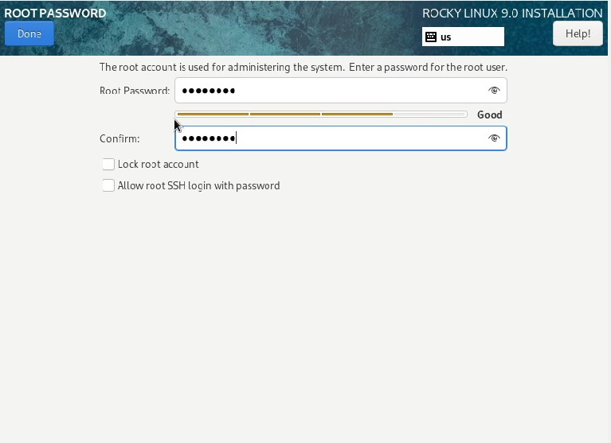
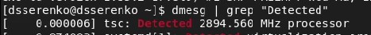
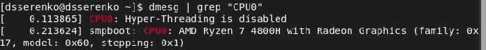
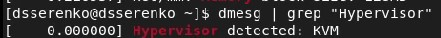
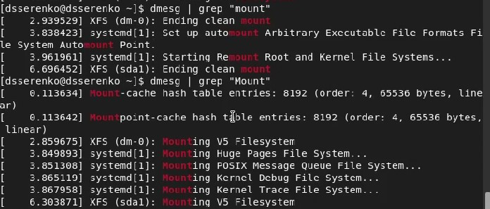

---
# Front matter
lang: ru-RU
title: Информационная безопасность. Лабораторная работа № 1 на тему "Установка и конфигурация операционной системы на виртуальную машину"
author: Серенко Данил Сергеевич
group: NFIbd-01-19
institute: RUDN University, Moscow, Russian Federation

# Formatting
toc: false
slide_level: 2
header-includes: 
 - \metroset{progressbar=frametitle,sectionpage=progressbar,numbering=fraction}
 - '\makeatletter'
 - '\beamer@ignorenonframefalse'
 - '\makeatother'
aspectratio: 43
section-titles: true
theme: metropolis

---

# Содержание
* Цели и задачи
* Выполнение
* Результаты
* Список литературы

# Цели и задачи
1. Приобретение практических навыков
установки операционной системы на виртуальную машину
2. Настройка минимально необходимых для дальнейшей работы сервисов

# Выполнение
## Выполнение
-Создана виртуальная машина

## Выполнение
-Произведены настройки ОС

## Выполнение

## Выполнение

## Выполнение

## Выполнение

## Выполнение

## Выполнение

# Результаты
1. Приобретены практические навыки
установки операционной системы на виртуальную машину
2. Настроены минимально необходимые для дальнейшей работы сервисы

# Список литературы
1. Методические материалы курса
2. Задание к лабораторной работе № 1