---
# Front matter
title: "Лабораторная работа 2"
author: "Серенко Данил Сергеевич, НФИбд-01-19"

# Generic otions
lang: ru-RU
toc-title: "Содержание"

# Bibliography
bibliography: bib/cite.bib
csl: pandoc/csl/gost-r-7-0-5-2008-numeric.csl

# Pdf output format
toc: true # Table of contents
toc_depth: 2
lof: true # List of figures
lot: true # List of tables
fontsize: 12pt
linestretch: 1.5
papersize: a4
documentclass: scrreprt
## I18n
polyglossia-lang:
  name: russian
  options:
	- spelling=modern
	- babelshorthands=true
polyglossia-otherlangs:
  name: english
### Fonts
mainfont: PT Serif
romanfont: PT Serif
sansfont: PT Sans
monofont: PT Mono
mainfontoptions: Ligatures=TeX
romanfontoptions: Ligatures=TeX
sansfontoptions: Ligatures=TeX,Scale=MatchLowercase
monofontoptions: Scale=MatchLowercase,Scale=0.9
## Biblatex
biblatex: true
biblio-style: "gost-numeric"
biblatexoptions:
  - parentracker=true
  - backend=biber
  - hyperref=auto
  - language=auto
  - autolang=other*
  - citestyle=gost-numeric
## Misc options
indent: true
header-includes:
  - \linepenalty=10 # the penalty added to the badness of each line within a paragraph (no associated penalty node) Increasing the value makes tex try to have fewer lines in the paragraph.
  - \interlinepenalty=0 # value of the penalty (node) added after each line of a paragraph.
  - \hyphenpenalty=50 # the penalty for line breaking at an automatically inserted hyphen
  - \exhyphenpenalty=50 # the penalty for line breaking at an explicit hyphen
  - \binoppenalty=700 # the penalty for breaking a line at a binary operator
  - \relpenalty=500 # the penalty for breaking a line at a relation
  - \clubpenalty=150 # extra penalty for breaking after first line of a paragraph
  - \widowpenalty=150 # extra penalty for breaking before last line of a paragraph
  - \displaywidowpenalty=50 # extra penalty for breaking before last line before a display math
  - \brokenpenalty=100 # extra penalty for page breaking after a hyphenated line
  - \predisplaypenalty=10000 # penalty for breaking before a display
  - \postdisplaypenalty=0 # penalty for breaking after a display
  - \floatingpenalty = 20000 # penalty for splitting an insertion (can only be split footnote in standard LaTeX)
  - \raggedbottom # or \flushbottom
  - \usepackage{float} # keep figures where there are in the text
  - \floatplacement{figure}{H} # keep figures where there are in the text
---

<h1 align="center">

РОССИЙСКИЙ УНИВЕРСИТЕТ ДРУЖБЫ НАРОДОВ 

Факультет физико-математических и естественных наук  

Кафедра прикладной информатики и теории вероятностей

ОТЧЕТ ПО ЛАБОРАТОРНОЙ РАБОТЕ №2
  
<h2 align="right">

дисциплина: Информационная безопасность

Преподователь: Кулябов Дмитрий Сергеевич

Студент: Серенко Данил Сергеевич

Группа: НФИбд-01-19
  
  
<h1 align="center">

МОСКВА

2022 г.
</h1>

# **Цель работы**

Получение практических навыков работы в консоли с атрибутами файлов, закрепление теоретических основ дискреционного разграничения доступа в современных системах с открытым кодом на базе ОС Linux.

# **Теоретическое введение**

useradd - добавление пользователя

passwd - установка пароля

pwd - местоположение по файловой системе

whoami - узнать логин

id - информация о пользователе

chmod - изменение атрибутов файла

# **Выполнение лабораторной работы**

1. На виртуальной машине создал нового пользователя guest и задал для него пароль (Рис [@fig:1])

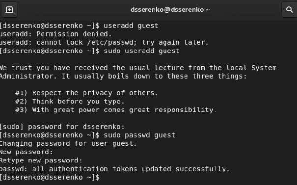{ #fig:1 width=90% }

2. Вошёл в систему от имени guest

3. Командой pwd определил каталог, в котором нахожусь. Данный каталог является домашним для пользователя guest, что совпадает с приглашением в командной строке (Рис [@fig:2]).

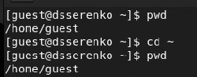{ #fig:2 width=90% }

4. Уточнил имя пользователя (Рис [@fig:3])

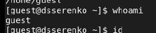{ #fig:3 width=90% }

5. Вывел на экран информацию о пользователе. Guest имеет идентификатор 1001(guest), группа пользователя 1001(guest), состоит в группе 1001(guest). Команда groups выдаёт группу guest (Рис [@fig:4]).

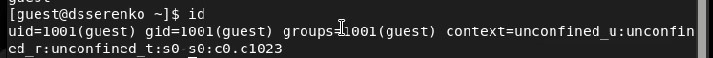{ #fig:4 width=90% }

6. Просмотрел файл passwd, в котором увидел, что данные из пункта 5, совпадают с данными в файле, то есть uid = 1001, gid = 1001 (Рис [@fig:5]).

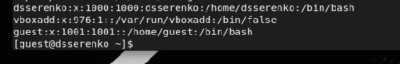{ #fig:5 width=90% }

7. На данный момент в системе находится 2 домашних директории (Рис [@fig:6]). Для каждого пользователя по одной, а именно gsyudin и guest. У обоих есть права только для пользователя.

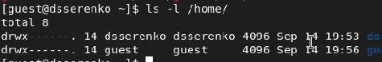{ #fig:6 width=90% }

8. Расширенные атрибуты я смог увидеть только у каталога guest, потому что в данный момент я залогинен под ним. Как можно заметить, ни один из расширенных атрибутов не стоит (Рис [@fig:7]).

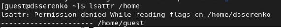{ #fig:7 width=90% }

9. В домашней директории создал каталог dir1 и убрал все права. После этого попытался создать файл, и файл не создался, так как прав на каталог у меня нет (Рис [@fig:8]).

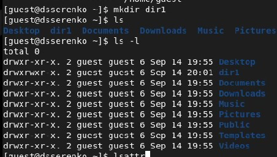{ #fig:8_1 width=90% }
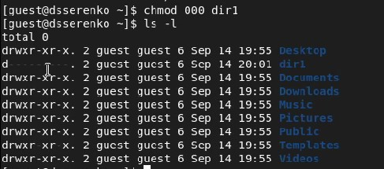{ #fig:8_2 width=90% })
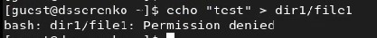{ #fig:88_3 width=90% }

10. Экспериментальным путём заполнил таблицу с правами и возможностями (Рис [@fig:9] и [@fig:10]).

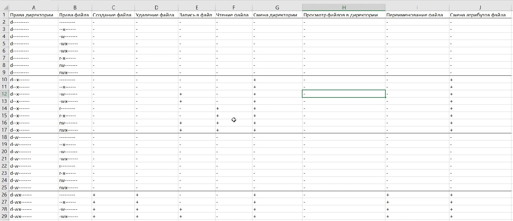{ #fig:9 width=90% }

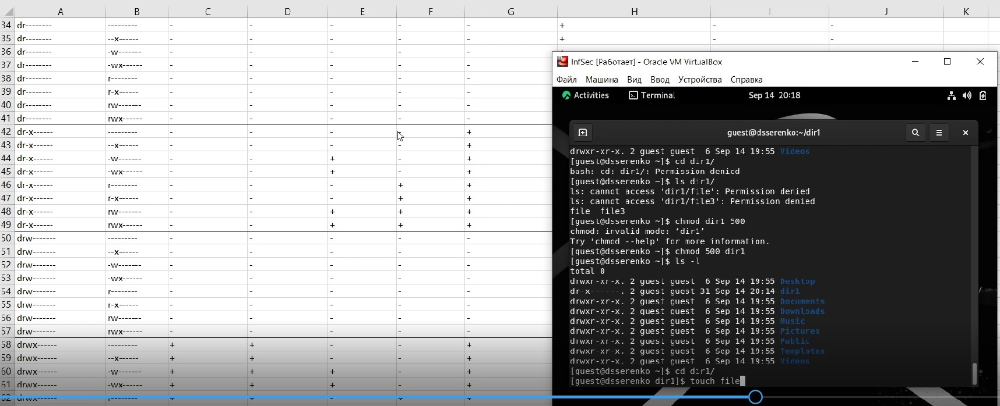{ #fig:10 width=90% }

11. В отдельной таблице указал минимальные права для определённых действий (Рис [@fig:11]).

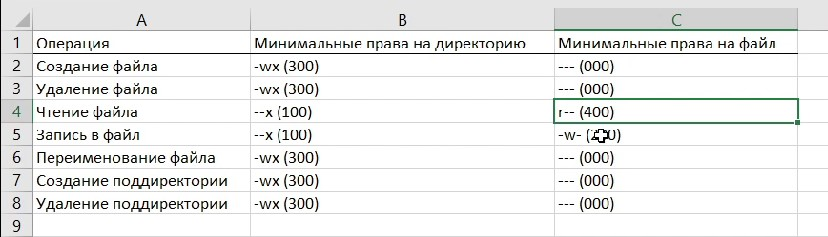{ #fig:11 width=90% }

# Выводы

Выполнив данную лабораторную работу, я создал нового пользователя, определил необходимую информацию, а также определил права, необходимые для действий с файлами и каталогами.

# Список литературы

1. Кулябов, Д.С. - Лабораторная работа № 2. Дискреционное разграничение прав в Linux. Основные атрибуты
https://esystem.rudn.ru/pluginfile.php/1651883/mod_resource/content/6/002-lab_discret_attr.pdf
