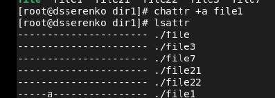

#### РОССИЙСКИЙ УНИВЕРСИТЕТ ДРУЖБЫ НАРОДОВ
#### Факультет физико-математических и естественных наук  
#### Кафедра прикладной информатики и теории вероятностей 
#### ПРЕЗЕНТАЦИЯ ПО ЛАБОРАТОРНОЙ РАБОТЕ №4

###### дисциплина: Информационная безопасность
###### Преподователь: Кулябов Дмитрий Сергеевич
###### Студент: Серенко Данил Сергеевич
###### Группа: НФИбд-01-19
МОСКВА
2022 г.

---

# **Прагматика выполнения лабораторной работы**

- работа с расширенными атрибутами

---

# **Цель работы**

Получение практических навыков работы в консоли с расширенными атрибутами файлов.

---

# **Выполнение лабораторной работы**

# 1. Просмотр расширенных атрибутов файла

---

# 2. Установка расширенного атрибута.
Атрибут a - разрешает дозапись в файл, при этом сам файл менять нельзя.

---

# 3. Изменение файла.

---

# 4. Проверил то же самое с атрибутом i.
Данный атрибут не даёт менять файл, в том числе нельзя удалять файл.

---

# Вывод
Выполнив данную лабораторную работу, я ознакомился с расширенными атрибутами файлов, а именно a и i, первый позволяет дозаписывать файл, а второй не позволяет менять файл совсем.