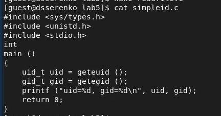
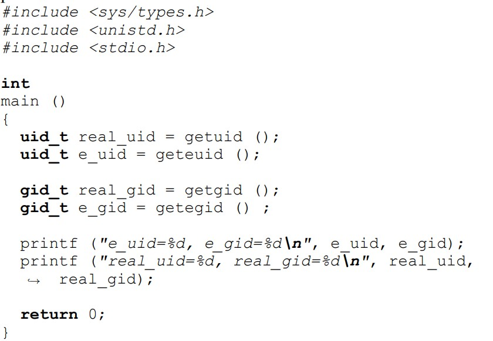
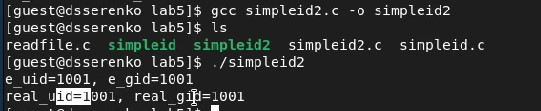
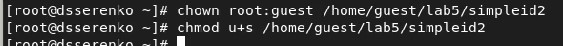
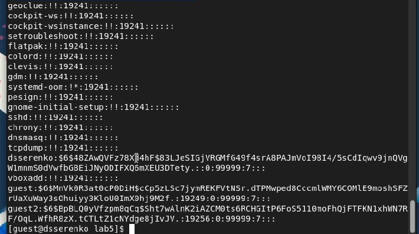
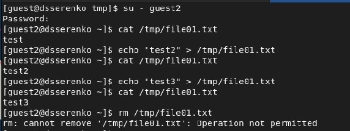

#### РОССИЙСКИЙ УНИВЕРСИТЕТ ДРУЖБЫ НАРОДОВ
#### Факультет физико-математических и естественных наук  
#### Кафедра прикладной информатики и теории вероятностей 
#### ПРЕЗЕНТАЦИЯ ПО ЛАБОРАТОРНОЙ РАБОТЕ №5

###### дисциплина: Информационная безопасность
###### Преподователь: Кулябов Дмитрий Сергеевич
###### Студент: Серенко Данил Сергеевич
###### Группа: НФИбд-01-19
МОСКВА
2022 г.

---

# **Прагматика выполнения лабораторной работы**

- работа с дополнительными атрибутами

---

# **Цель работы**

Изучение механизмов изменения идентификаторов, применения SetUID и Sticky-битов.

---

# **Выполнение лабораторной работы**

# 1. Создание программы simpleid.c. и выполнение

---

# 2. Создание программы simpleid2.c. и выполнение

---

# 3. Установка новых аттрибутов и запуск simpledid2

---

# 4. Создание программы readfile.c

---

# 5. Смена владельца readfile

---

# 6. Смена владельца readfile и установил SetU’D-бит

---

# 7. Проверка sticky бит на категории tmp.

---

# 8. Выполнение различных операций от guest2

---

# 9. Снятие атрибут t (Sticky-бит) сдиректории /tmp и выполнение предыдущих шагов

---

# Вывод

Выполнив данную лабораторную работу, я получение практические навыков работы в консоли с дополнительными атрибутами. Рассмотрел работы механизма смены идентификатора процессов пользователей, а также влияние бита Sticky на запись и удаление файлов.