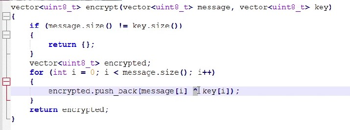
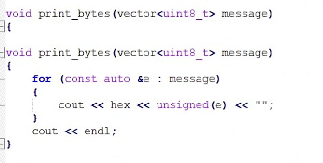
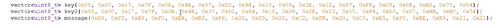
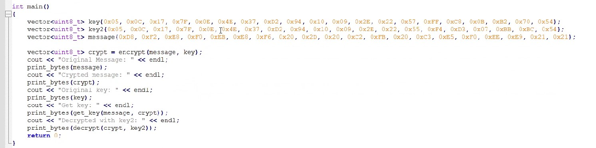
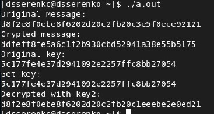

<!-- _class: titleslide -->

#### РОССИЙСКИЙ УНИВЕРСИТЕТ ДРУЖБЫ НАРОДОВ
#### Факультет физико-математических и естественных наук  
#### Кафедра прикладной информатики и теории вероятностей 
#### ПРЕЗЕНТАЦИЯ ПО ЛАБОРАТОРНОЙ РАБОТЕ №7

###### дисциплина: Информационная безопасность
###### Преподователь: Кулябов Дмитрий Сергеевич
###### Студент: Серенко Данил Сергеевич
###### Группа: НФИбд-01-19
МОСКВА
2022 г.

---

# **Прагматика выполнения лабораторной работы**

- Требуется разработать приложение позволяющие шифровать и дешифровать данные в режиме однократного гаммирования.

Приложение должно:

1. Определить вид шифротекста при известном ключе и известном открытом тексте.
2. Определить ключ, с помощью которого шифротекст может быть преобразован в некоторый фрагмент текста, представляющий собой один из возможных вариантов прочтения открытого текста.

---

# **Цель работы**

Освоить на практике применение режима однократного гаммирования.

---

# **Выполнение лабораторной работы**

# 1. Создал функцию позволяющую зашифровывать, расшифровывать данные с помощью сообщения и ключа. А также позволяющую получить ключ.

---

# 2. Cоздал функцию для вывода результатов

---

# 3. Определил биты ключей и сообщения

---

# 4. Определил главную функцию 

---

# 5. Запуск программы.

---

# Выводы

В результате выполнения работы я освоил на практике применение режима однократного гаммирования.

---
